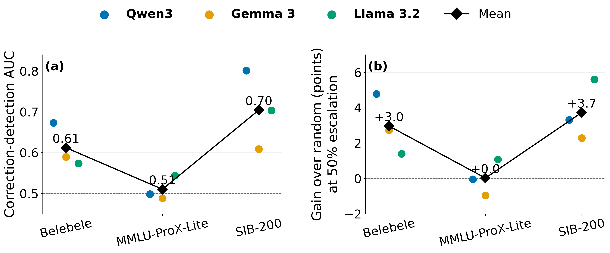

<div align="center">

# 🌐 Multilingual LLM Routing

### A Systematic Study of Confidence Based Small to Large LLM Routing

**Evaluating Qwen3, Gemma 3, and Llama 3.2 across multilingual reading comprehension, reasoning, and topic classification.**

[](https://www.python.org/)
[](https://pytorch.org/)
[](https://huggingface.co/docs/transformers/)
[](https://huggingface.co/Qwen)
[](https://huggingface.co/google)
[](https://huggingface.co/meta-llama)

</div>

---


> ### 💡 TL;DR
>
> <p align="justify">This repository contains a reproducible framework for studying confidence based small to large language model routing across English, Bangla, Hindi, and Urdu. The experiments cover three model families and three multilingual tasks. The central result is that confidence routing is task dependent. It improves over random routing on multilingual reading comprehension and topic classification, but provides little advantage on multilingual reasoning because small models can remain highly confident while incorrect.</p>

---

## 📖 Overview

This project studies whether small to large model routing can reduce the use of larger language models while preserving multilingual accuracy.

<p align="justify">Each example is first evaluated by a small model. The routing policy then decides whether to retain the small model prediction or escalate the example to the corresponding large model. Confidence is measured using the margin between the two highest answer probabilities produced by the small model.</p>

<p align="justify">The study compares routing behavior across model families, task types, and languages. It also examines whether confidence ranking distributes escalation resources evenly across languages and whether low confidence reliably identifies errors that the large model can correct.</p>

---

## 📑 Table of Contents

1. [Overview](#-overview)
2. [Models](#-models)
3. [Languages and Datasets](#-languages-and-datasets)
4. [Routing Policies](#-routing-policies)
5. [Experimental Setup](#-experimental-setup)
6. [Evaluation Metrics](#-evaluation-metrics)
7. [Routing Behavior](#-routing-behavior)
8. [Statistical Analysis](#-statistical-analysis)
9. [Checkpoint and Resume](#-checkpoint-and-resume)
10. [Repository Structure](#-repository-structure)
11. [Usage](#-usage)
12. [Status](#-status)
13. [Author](#-author)

---

## 🤖 Models

The experiments use matched small and large models from three model families.

| Family | Small Model | Large Model |
| --- | --- | --- |
| Qwen3 | `Qwen/Qwen3-1.7B` | `Qwen/Qwen3-4B` |
| Gemma 3 | `google/gemma-3-1b-it` | `google/gemma-3-4b-it` |
| Llama 3.2 | `meta-llama/Llama-3.2-1B-Instruct` | `meta-llama/Llama-3.2-3B-Instruct` |

<p align="justify">Using matched models from the same family allows the routing analysis to compare capacity levels without introducing unrelated architectural differences. Qwen3 is evaluated with thinking disabled. Gemma 3 4B uses stable float32 inference for the corrected MMLU-ProX-Lite and SIB-200 evaluations.</p>

---

## 🌍 Languages and Datasets

The same four languages are evaluated across all datasets.

| Code | Language |
| --- | --- |
| `eng_Latn` | English |
| `ben_Beng` | Bangla |
| `hin_Deva` | Hindi |
| `urd_Arab` | Urdu |

Three datasets represent different task types.

| Dataset | Task | Examples per Language |
| --- | --- | ---: |
| Belebele | Reading comprehension | 900 |
| MMLU-ProX-Lite | Multilingual reasoning | 658 |
| SIB-200 | Topic classification | 204 |

<p align="justify">Parallel example identifiers are preserved across languages. This supports paired routing analysis and bootstrap resampling over corresponding questions.</p>

---

## 🔀 Routing Policies

The analysis compares four routing policies.

| Policy | Description |
| --- | --- |
| Confidence | Escalates examples with the lowest small model confidence margin |
| Equal quota | Applies confidence ranking within each language using an equal escalation quota |
| Random | Escalates a cost matched random subset |
| Oracle | Uses observed correctness transitions as an unattainable upper bound |

Routing budgets range from 0 to 100 percent in increments of 10 percent. Random routing is repeated 100 times using fixed seeds.

---

## 🧪 Experimental Setup

The completed experiment matrix contains:

**3 datasets × 3 model families × 2 model sizes × 4 languages = 72 official evaluations**

| Dataset | Qwen3 | Gemma 3 | Llama 3.2 |
| --- | ---: | ---: | ---: |
| Belebele | ✓ | ✓ | ✓ |
| MMLU-ProX-Lite | ✓ | ✓ | ✓ |
| SIB-200 | ✓ | ✓ | ✓ |

All configurations use the same standardized examples and deterministic scoring procedure.

```yaml
seed: 42
max_input_tokens: 4096
batch_size: 1
checkpoint_every: 25
```

---

## 📏 Evaluation Metrics

The primary evaluation metric is **Accuracy**.

Additional analyses include:

1. Confidence margin
2. Maximum choice probability
3. Correction detection AUC
4. Small to large correction and regression rates
5. Worst language accuracy
6. Language accuracy gap
7. Language escalation gap
8. Accuracy at fixed escalation budgets

---

## 📈 Routing Behavior

<p align="center">
  
</p>

<p align="justify">Confidence based routing behaves differently across tasks. It provides consistent gains over random escalation on Belebele and SIB-200. On MMLU-ProX-Lite, correction detection remains close to chance and confidence routing provides little improvement over random routing.</p>

<p align="justify">The oracle results show that correctable examples remain available on the reasoning task, but small model confidence does not reliably identify them. This produces a high confidence error failure mode in which escalation decisions cannot be made reliably from confidence alone.</p>

Detailed numerical tables and raw prediction files are excluded from version control.

---

## 📊 Statistical Analysis

Routing comparisons use paired bootstrap resampling over parallel example identifiers.

```text
bootstrap_repeats = 5000
bootstrap_unit = example_id
confidence_interval = 95%
```

The final analysis compares confidence routing with random routing and equal quota routing at 25 and 50 percent escalation budgets.

---

## 💾 Checkpoint and Resume

Long model evaluations use checkpoint based recovery.

```text
checkpoint_every = 25
resume = True
```

Completed examples are identified from existing prediction files and skipped during resumed evaluation.

<p align="justify">Limited development runs and official full runs use different output filenames, preventing development predictions from contaminating final experiment files.</p>

---

## 📁 Repository Structure

```text
multilingual-llm-routing/
│
├── analysis/
│   ├── analyze_results.py
│   ├── make_figures.py
│   ├── make_report.py
│   └── statistical_tests.py
│
├── assets/
│   └── 00_introduction_teaser.png
│
├── data/
│   ├── download_data.py
│   ├── import_phase1_results.py
│   └── dataset_manifest.json
│
├── efficiency/
│   └── benchmark.py
│
├── evaluation/
│   └── score_models.py
│
├── experiments/
│   └── run_all.py
│
├── models/
│   └── model_utils.py
│
├── routing/
│   ├── advanced_routes.py
│   └── simulate_routes.py
│
├── results/
│   ├── canonical/
│   └── paper_analysis/
│
├── config.yaml
├── requirements.txt
├── LICENSE
├── .gitignore
└── README.md
```

<p align="justify">Datasets, raw predictions, canonical result archives, analysis tables, and generated paper figures are excluded from version control. The introduction figure in the assets directory is retained for the repository overview.</p>

---

## 🚀 Usage

Clone the repository:

```bash
git clone https://github.com/sabbir5622r/multilingual-llm-routing.git

cd multilingual-llm-routing
```

Install the dependencies:

```bash
pip install -r requirements.txt
```

Download and standardize the datasets:

```bash
python data/download_data.py \
    --datasets belebele mmlu_prox_lite sib200
```

Run one model configuration:

```bash
python evaluation/score_models.py \
    --family qwen \
    --size small \
    --dataset belebele \
    --language eng_Latn
```

Run the complete experiment matrix:

```bash
python experiments/run_all.py \
    --datasets belebele mmlu_prox_lite sib200 \
    --families qwen gemma llama \
    --skip-download
```

Place the corrected canonical result archive at:

```text
results/canonical/multilingual_routing_corrected_full_results.zip
```

Generate the final analysis tables and figures:

```bash
python analysis/analyze_results.py
python analysis/make_figures.py
```

---

## 📝 Status

The 72 official model evaluations have been completed across all datasets, model families, model sizes, and languages.

<p align="justify">The corrected canonical result archive has been validated. Current work focuses on manuscript preparation, final figure selection, and reproducibility documentation.</p>

---

## 👤 Author

**Md Sabbir Hossen**

Student | Research Assistant

<p align="justify">Research interests include Natural Language Processing, Computer Vision, Large Language Models, Vision Language Models, and Efficient AI.</p>

GitHub: [sabbir5622r](https://github.com/sabbir5622r)

Personal Website: [sabbir-hossen.com](https://sabbir-hossen.com/)


